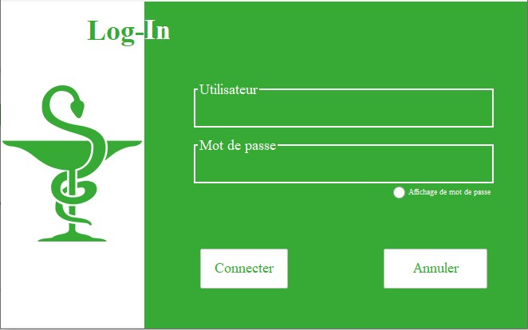
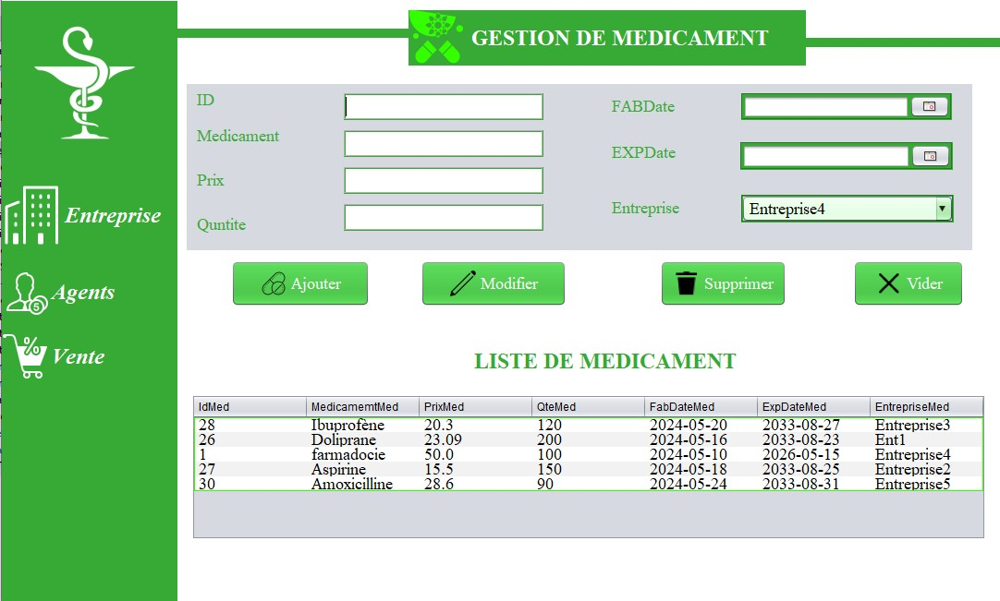
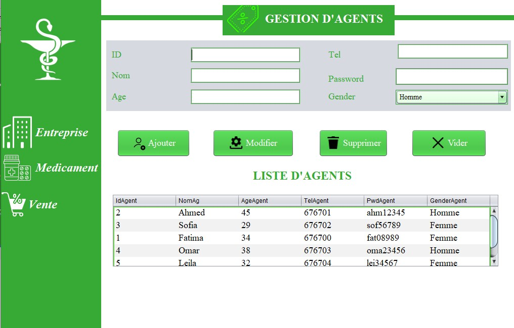
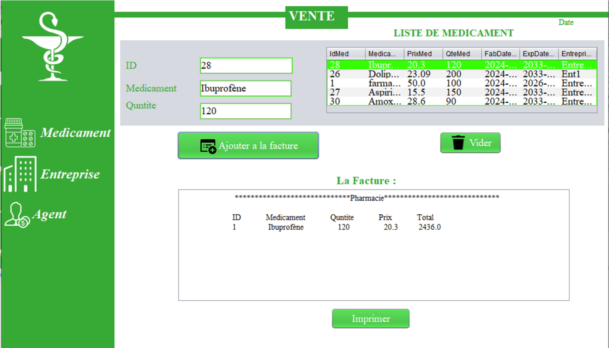
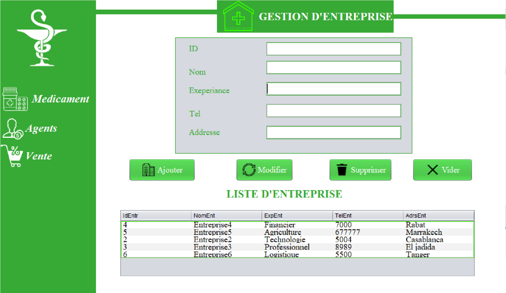

# 💊 PharmacyManager - Application de Gestion de Pharmacie en Java

Une application desktop complète développée en Java avec Swing et JDBC, permettant de gérer les opérations quotidiennes d'une pharmacie : gestion des médicaments, entreprises, agents, ventes, et connexions sécurisées.

📁 Structure du projet

Le projet est organisé comme suit :

PharmacyManager/
├── src/
│   ├── Agent.java
│   ├── Midcine.java
│   ├── Vente.java
│   ├── Entereprise.java
│   ├── login.java
│   └── Principale.java
├── Capteurs/           # Dossier pour fichiers ou modules de capteurs externes
├── database/           # Contient les scripts SQL et schémas de la base de données
└── README.md

## 📷 Aperçu de l'interface


 
1.	Interface Client : 
 
 
 
       L'interface de l'application Java Swing "Principale" pour une pharmacie permet de rechercher des médicaments dans une base de données. Elle contient un champ de texte pour entrer le nom d'un médicament, un bouton de recherche (icône de loupe), et une zone de texte pour afficher les résultats. Lorsqu'un utilisateur saisit le nom d'un médicament et clique sur la loupe, l'application se connecte à une base de données MySQL, exécute une requête SQL pour trouver le médicament correspondant, puis affiche son nom et son prix dans la zone de résultats. Si le médicament n'est pas trouvé, un message approprié est affiché. L'interface inclut également des éléments visuels et informatifs comme des images des médicaments, des descriptions détaillées, et des informations sur les dosages et les précautions à prendre. De plus, des boutons de navigation permettent d'accéder à d'autres fonctionnalités de l'application, comme la gestion des stocks et la commande de nouveaux médicaments, rendant l'utilisation de l'application intuitive et efficace pour les employés de la pharmacie. 
 
2.	Interface login :  
 	 
 

                      
                  Cette interface permet aux utilisateurs de se connecter à l'application de pharmacie en vérifiant leurs informations d'identification contre une base de données MySQL. 
 
3.	Interface Medicament : 
                             
 
 
                     L'interface graphique médicament permet aux utilisateurs de gérer les médicaments d'une pharmacie en offrant des fonctionnalités pour ajouter, modifier et supprimer des médicaments dans la base de données. Cette interface utilise une connexion à une base de données MySQL pour stocker et récupérer les informations sur les médicaments. Elle permet aux utilisateurs de voir tous les médicaments enregistrés dans la base de données via une table, de remplir des formulaires pour ajouter de nouveaux médicaments ou modifier des médicaments existants, et de supprimer des médicaments en utilisant l'ID unique associé à chaque médicament. Les dates de fabrication et d'expiration sont également gérées, assurant ainsi que les utilisateurs peuvent suivre la durée de vie des médicaments. En outre, la sélection de l'entreprise fournissant le médicament est facilité par un menu déroulant. Cette interface assure une gestion efficace et organisée des médicaments, contribuant à une meilleure administration des stocks dans la pharmacie. 
 
4.	Interface Agent : 
                                  
 
 
Cette interface est conçue pour aider les responsables de pharmacie à gérer leur personnel, en particulier les agents. Voici ce que vous pouvez faire avec cette interface : 
	Ajouter un nouvel agent : Si un nouveau membre rejoint l'équipe, vous pouvez facilement l'ajouter en saisissant ses informations telles que son nom, son âge, son numéro de téléphone et son genre. Une fois les détails saisis, vous appuyez sur un bouton pour les enregistrer dans le système. 
	Modifier les détails des agents existants : Parfois, les informations des agents changent. Peut-être qu'ils ont déménagé ou qu'ils ont un nouveau numéro de téléphone. Avec cette interface, vous pouvez sélectionner l'agent dont vous devez mettre à jour les informations, apporter les modifications nécessaires et enregistrer les nouvelles informations. 
	Supprimer un agent : Si un agent quitte l'équipe ou n'est plus nécessaire, vous pouvez le supprimer de la liste. Il vous suffit de sélectionner l'agent à supprimer et de cliquer sur un bouton pour retirer ses informations de la base de données. 
	Visualiser la liste des agents : Une liste de tous les agents actuellement enregistrés dans le système est affichée dans un tableau. Cela vous permet de voir rapidement qui fait partie de l'équipe et quelles sont leurs informations. 
	En bref, cette interface facilite la gestion des ressources humaines de la pharmacie, en offrant un moyen simple et efficace d'ajouter, de modifier et de supprimer les détails des agents. 
 
5.	Interface Vente : 

   
 
  
Cette interface Java Swing, nommée "Vente", est conçue pour faciliter la gestion des ventes de médicaments dans une pharmacie. Son objectif principal est de fournir aux utilisateurs une plateforme conviviale pour effectuer des transactions de vente de manière efficace et précise. 
Voici quelques points clés sur le but principal de cette interface en quelques lignes : 
	Enregistrement des Ventes : L'interface permet aux utilisateurs d'enregistrer les ventes de médicaments en saisissant l'identifiant du médicament, le nom du médicament et la quantité vendue. 
	Affichage des Médicaments : Une liste des médicaments disponibles est affichée dans un tableau, ce qui permet aux utilisateurs de sélectionner facilement le médicament à vendre. 
	Facturation Automatique : Après avoir ajouté un médicament à la vente, la facture est automatiquement mise à jour, affichant les détails de l'article vendu ainsi que le montant total à payer. 
	Impression de la Facture : Les utilisateurs ont la possibilité d'imprimer la facture directement depuis l'interface, ce qui simplifie le processus de documentation des transactions. 
	Interface Intuitive : L'interface est conçue de manière à être conviviale et facile à utiliser, permettant aux utilisateurs de naviguer sans effort et de réaliser des ventes rapidement. 
6.	Interface Enterprise : 
  
  
  
  Dans cette interface entreprise, l'admin doit gérer les entreprises qui vont livrer leurs produits à notre pharmacie. L'admin doit pouvoir ajouter, modifier ou supprimer une entreprise. Pour ajouter une entreprise, il faut saisir toutes les informations de cette entreprise et cliquer sur le bouton "Ajouter". Après avoir cliqué sur "Ajouter", l'entreprise doit être insérée dans la base de données et affichée dans le tableau des entreprises dans cette interface. Pour modifier les informations d'une entreprise, on doit entrer l'ID et les informations à modifier, puis cliquer sur "Modifier". Cela mettra à jour la base de données et affichera les modifications dans ce tableau. Pour supprimer une entreprise, il suffit de saisir l'ID de l'entreprise et de cliquer sur "Supprimer". L'entreprise sera alors supprimée de la base de données et le tableau restant sera affiché dans cette interface. 


## 🎯 Fonctionnalités principales

### 🔐 Authentification
- Connexion utilisateur avec vérification sécurisée depuis base de données.
- Affichage du mot de passe en option.

### 👨‍⚕️ Gestion des Agents
- Ajouter, modifier, supprimer un agent (ID, nom, âge, téléphone, genre, mot de passe).
- Affichage en tableau avec sélection automatique.

### 🏢 Gestion des Entreprises
- Création et administration des fournisseurs de médicaments.
- Informations : nom, adresse, expérience, téléphone.

### 💊 Gestion des Médicaments
- Ajout et gestion des médicaments (nom, prix, quantité, entreprise liée).
- Gestion des dates de fabrication et expiration.

### 💸 Gestion des Ventes
- Sélection rapide d’un médicament depuis une liste.
- Impression de factures avec calcul automatique.
- Affichage de la date courante.

---

## 🛠️ Technologies utilisées

- **Java 8+**
- **Swing** (interface graphique)
- **JDBC** (connexion base de données)
- **NetBeans** (développement)
- **MySQL** (base de données)
- **DbUtils** (pour gérer les modèles de tableaux)

---

## ⚙️ Installation & Exécution

### 📥 Prérequis
- JDK installé
- MySQL installé et base de données configurée
- NetBeans (ou autre IDE Java)

### 📌 Étapes
1. Clonez le projet :
   ```bash
   git clone https://github.com/votre-utilisateur/pharmacie-java.git
   cd pharmacie-java
   ```
2. Ouvrez le projet dans NetBeans.
3. Configurez votre base de données MySQL selon le schéma fourni.
4. Lancez `login.java` pour démarrer l'application.

---

## 👨‍💻 Auteur

**Youssef Loul**  
📧 youssef.loul.ai@gmail.com  
Compétences : Java, SQL, HTML, CSS, JS, PHP, Python
## 📄 Licence

Projet sous licence **MIT** — libre à utiliser, modifier et redistribuer avec attribution.

---

## ✅ Conclusion

Cette application offre une solution complète, intuitive et moderne pour répondre aux besoins des pharmacies dans la gestion de leurs opérations internes. 

> ⭐ N'hésitez pas à laisser une étoile ou à nous contacter pour toute suggestion ou contribution.

